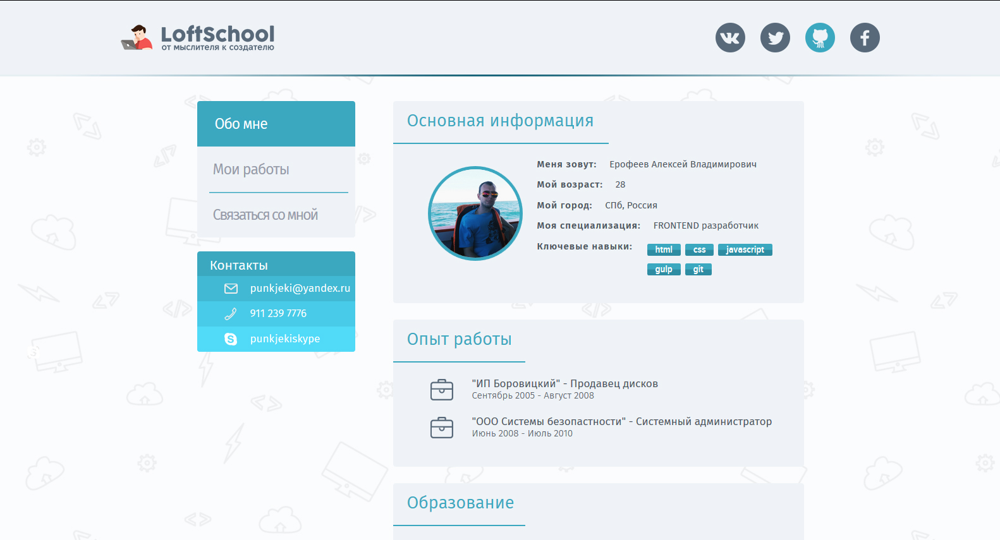
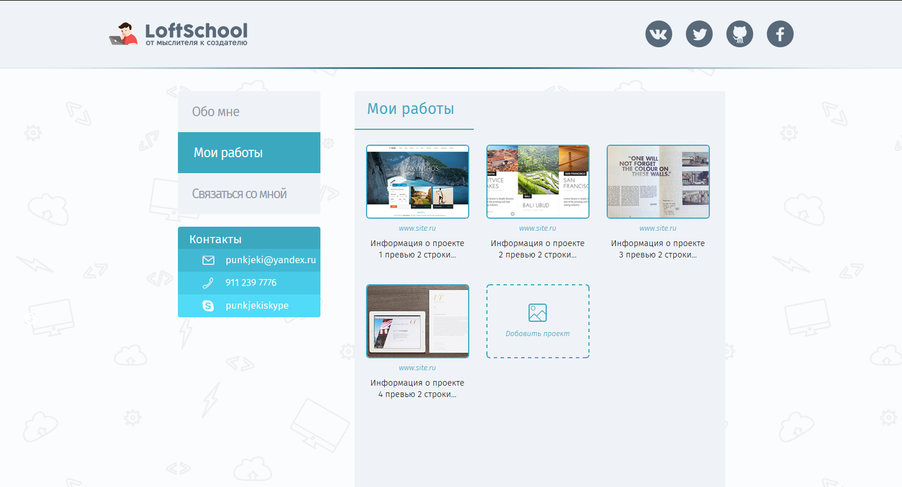
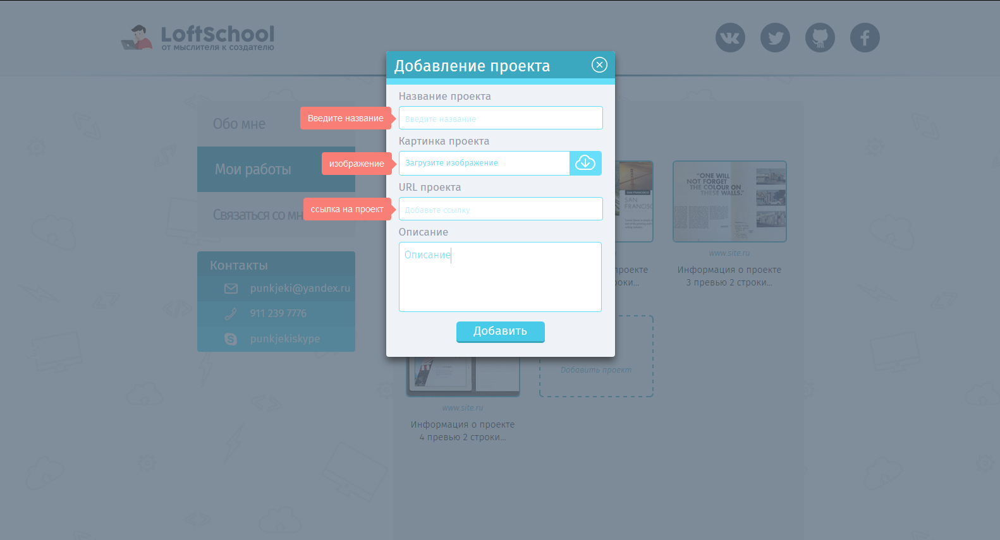
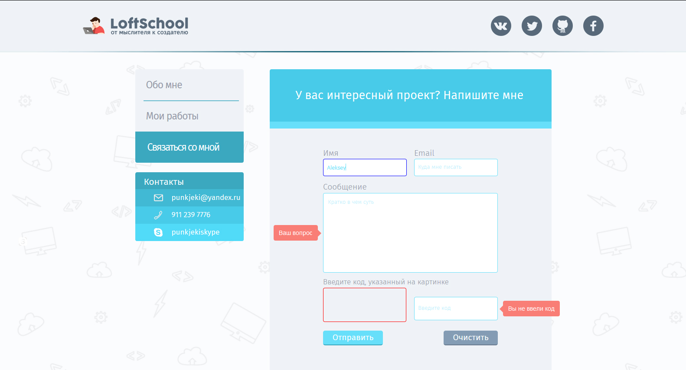

# Сайт визитка

Самый обычный сайт визитка, состоящий из трех страниц: главной, портфолио и страници с формой отправки писем владельцу сайта.

## Главная страница

  

Главная страница содержит общую информацию о владельце сайта, такую как:

*   ФИО
*   Возраст
*   Город проживания
*   Специализация
*   Ключевые навыки
*   Опыт работы
*   Образование
*   Контакты

## Страница портфолио

  

Страница портфолио содержит примеры работ владельца сайта, а так же оснащена формой добавления новых работ.

### Форма добавления новых работ

Форма оснащена подсказками, если пользователь забыл ввести информацию, то напротив пустого поля появится подсказка.

## Страница связаться со мной

  

Страница связаться со мной содержит форму отправки писем владельцу сайта. Форма так же оснащена подсказками, кнопкой сброса всех полей, а поле E-mail проверяет правильность введенного адреса.

## Поддержка браузерами

Поддерживаются все браузеры от IE8 и выше.

## Библиотеки используемые для этого проекта:

*   html5shiv.js
*   jQuery
*   modernizr
*   jquery-placeholder
*   tooltipster

## Как скачать проект

Перед тем как скачать проект убедитесь, что у вас установлены

*   [Node.js](https://nodejs.org/)
*   [NPM](https://www.npmjs.com/)
*   [Bower](http://bower.io/)
*   [Gulp](http://gulpjs.com/)

### Скачивание

В терминале перейдите в папку в которую будет скачиваться проект. После чего наберите команды

*   git clone https://github.com/AlexeyErofeyev/loftShool-Dz1-September2015.git
*   cd loftShool-Dz1-September2015
*   npm install
*   bower install
*   gulp

Проект сам запустится и откроется в браузере
